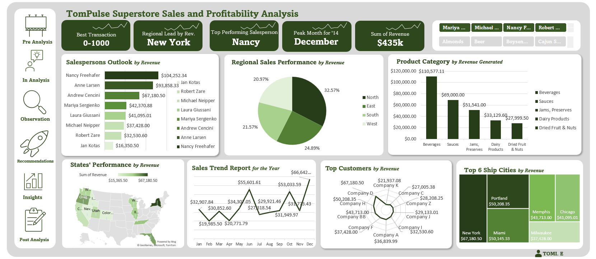

# TomPulse Superstore Sales & Profitability Analysis

> **Tools:** Microsoft Excel (Pivot Tables, Charts, Dashboard)  
> **Type:** Exploratory Data Analysis + Dashboard Design  
> **Dataset:** TomPulse superstore sales data — 2014 fiscal year  

## Project Overview
This project analyses 2014 sales data for TomPulse Superstore to help 
management make strategic decisions for the coming year. It covers sales 
trends, salesperson performance, regional breakdowns, product categories, 
customer revenue, and shipping city analysis.

## Steps Taken
1. **Data Familiarisation** — Reviewed raw dataset structure, fields, and 
   data types across 400+ transactions
2. **Data Cleaning** — Standardised date formats, checked for nulls, and 
   ensured consistency across columns
3. **Pivot Table Analysis** — Built pivot tables for each analysis area: 
   sales trend, rep performance, regional split, product categories, 
   top customers, and city/state performance
4. **Dashboard Design** — Designed an interactive dashboard with slicers, 
   KPI summary cards, and 7 chart types

## Key Findings
| Area | Finding |
|---|---|
| Total Revenue | $435,066 |
| Peak Month | December — $66,643 |
| Top Salesperson | Nancy Freehafer — $104,252 |
| Top Region | North — 32.6% of revenue |
| Top Product Category | Beverages — $110,577 |
| Top Ship City | New York — $67,181 |
| Most Common Transaction Range | $0–$1,000 (218 of ~400 orders) |

## Recommendations
- Invest in Beverages and investigate underperformance in Dairy & Dried Fruit
- Run targeted promotions in February and April to address seasonal dips
- Provide coaching or territory support for lower-performing sales reps
- Prioritise New York, Portland, and Miami in logistics and marketing planning

## Dashboard Preview

## About
Built by **Oluwatomisin Odeyale**  
Connect on [LinkedIn](https://www.linkedin.com/in/oluwatomisin-odeyale-54631a2a8?utm_source=share&utm_campaign=share_via&utm_content=profile&utm_medium=android_app)
